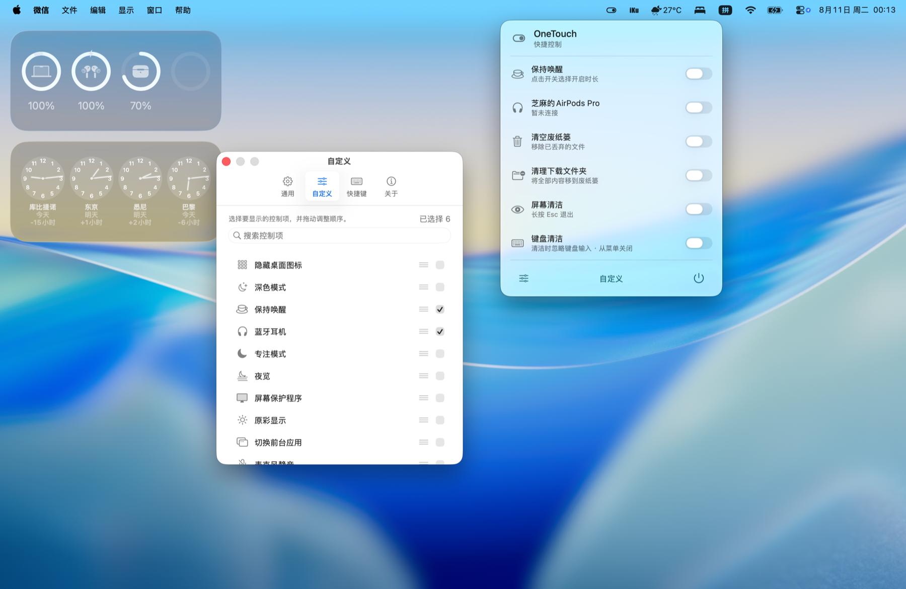

<p align="center">
  
</p>

<h1 align="center">OneTouch</h1>

<p align="center"><strong>一个开关，处理 Mac 上每天重复的小事。</strong></p>

<p align="center">
  <strong>简体中文</strong>
  ·
  <a href="README_EN.md">English</a>
</p>

<p align="center">
  OneTouch 是一款原生 macOS 菜单栏工具，把专注、显示、清理、设备与常用系统控制收进一个轻量面板。
</p>

## 界面预览

<p align="center">
  
</p>

OneTouch 使用 AppKit 原生面板、控件、字体、颜色与系统材质，并自动适配浅色和深色外观。

<p align="center">
  <a href="https://github.com/Cherry-Yiran/OneTouch/releases/latest"><strong>下载最新版</strong></a>
  ·
  <a href="https://github.com/Cherry-Yiran/OneTouch/releases">更新日志</a>
  ·
  <a href="https://github.com/Cherry-Yiran/OneTouch/issues">反馈问题</a>
</p>

<p align="center">
  <a href="https://github.com/Cherry-Yiran/OneTouch/releases/latest"></a>
  
  
  
</p>

## 为什么是 OneTouch

很多 macOS 设置并不难找，但每天重复打开设置、切换状态、确认权限，会打断正在做的事。OneTouch 把这些操作放到菜单栏：点一下开关，完成后继续工作。

- **一个入口**：常用控制集中在菜单栏，不用来回寻找系统设置
- **一个交互**：持续状态与一次性操作都使用系统开关
- **按自己习惯排列**：控制项数量不限，可搜索、勾选并拖动排序；超过 8 项时面板保持固定高度并滚动
- **原生 macOS 体验**：面板、开关、菜单、设置窗口和动态材质直接使用 AppKit
- **本机完成**：系统操作在本机执行，不上传操作数据

## 能做什么

### 专注与显示

- 深色模式、专注模式与保持唤醒，支持原生时长选择
- Night Shift、原彩显示、低电量模式与高能耗模式
- 切换屏幕分辨率、显示器休眠、屏幕保护程序与台前调度

### 桌面与效率

- 隐藏桌面图标、小组件、Dock 与 Finder 隐藏文件
- 控制 Music 与 Spotify 播放
- 全局快捷键、登录时启动、锁定屏幕
- 一键正常退出其他 Dock 应用，同时保留当前工作应用、OneTouch 与 Finder

### 清理与设备

- 屏幕清洁与键盘清洁
- 清理下载文件夹、Xcode 缓存、废纸篓与剪贴板
- 连接蓝牙耳机并查看电量
- 推出外接磁盘或已挂载的 DMG，并为重要磁盘设置保护名单
- 麦克风静音

OneTouch 当前提供 **30 个控制项**。不支持的硬件能力或未安装的应用会直接显示为不可用。

## 下载安装

1. 前往 [Releases](https://github.com/Cherry-Yiran/OneTouch/releases/latest) 下载最新的 `OneTouch_*_aarch64.dmg`
2. 打开 DMG，将 OneTouch 拖入“应用程序”
3. 首次启动时按引导授予辅助功能权限
4. 点击菜单栏中的开关图标打开 OneTouch

当前正式版支持 **Apple Silicon Mac**，要求 **macOS 13 或更高版本**。

公开构建使用固定的 OneTouch macOS 签名证书，并通过独立的 Tauri 更新签名校验；任一步签名验证失败，GitHub Actions 都不会公开 Release。由于没有走 Apple Developer ID 公证，首次打开时 macOS 仍可能要求前往“系统设置 → 隐私与安全性”手动允许。安装后可在“关于”页面检查、下载并安装新版本。

## 使用说明

- 普通控制：点击开关立即切换状态
- 一次性操作：开关在执行期间保持开启，完成后自动关闭
- 保持唤醒、深色模式、专注模式：关闭状态下点击开关，先用系统菜单选择持续时间
- 键盘清洁：临时忽略普通键、修饰键、功能键与媒体键，使用鼠标从菜单关闭
- 清理下载文件夹：把“下载”目录的全部内容移到系统废纸篓，不永久删除文件
- 关闭其他应用：只发送 macOS 标准退出请求，不会强制结束进程；有未保存内容时，由对应应用正常询问
- 自定义：在“偏好设置 → 自定义”中选择控制项并调整顺序
- 快捷键：在“偏好设置 → 快捷键”中为任意控制项录制全局快捷键

## 权限与安全边界

OneTouch 首次启动时会引导完成核心能力需要的辅助功能授权，避免之后反复中断操作。自动化、蓝牙或专注状态等专项权限只会在使用对应功能时请求。

- 所有系统操作都在这台 Mac 上执行
- 不上传控制记录或个人数据
- 不会强制结束其他应用
- 不会自动推出受保护的磁盘
- 更新包会使用 Tauri 签名校验

## 开发

技术栈：React、Vite、Tauri 2、Rust、Objective-C / AppKit、Core Graphics 与 IOBluetooth。

开发环境需要 macOS 13+、Node.js、pnpm、Rust stable 与 Apple Command Line Tools。

```bash
pnpm install
pnpm native:dev
```

运行测试：

```bash
pnpm test:ui
cargo test --manifest-path src-tauri/Cargo.toml
```

构建应用：

```bash
TAURI_SIGNING_PRIVATE_KEY="$(< /path/to/onetouch.key)" \
TAURI_SIGNING_PRIVATE_KEY_PASSWORD="your-key-password" \
pnpm native:build
```

构建产物位于 `src-tauri/target/release/bundle/`。推送 `v*` 标签会通过 GitHub Actions 创建草稿 Release，使用 `APPLE_CERTIFICATE` 与 `APPLE_SIGNING_IDENTITY` 完成固定身份签名，并使用 Tauri 私钥签署更新包；校验通过后才会公开并上传 DMG、自动更新包、签名和 `latest.json`。

## 设计与实现

OneTouch 坚持使用 Apple 公开的 AppKit 组件与系统语义参数，不手工模拟 macOS 的玻璃材质、颜色、模糊强度、按钮状态或菜单行为。

- [界面设计原则与布局约束](docs/DESIGN_PRINCIPLES.md)
- [Apple 官方组件来源](docs/APPLE_COMPONENTS.md)

## 参与项目

欢迎提交 [Issue](https://github.com/Cherry-Yiran/OneTouch/issues) 或 Pull Request。问题反馈请尽量附上 macOS 版本、OneTouch 版本、复现步骤和截图。
