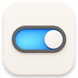
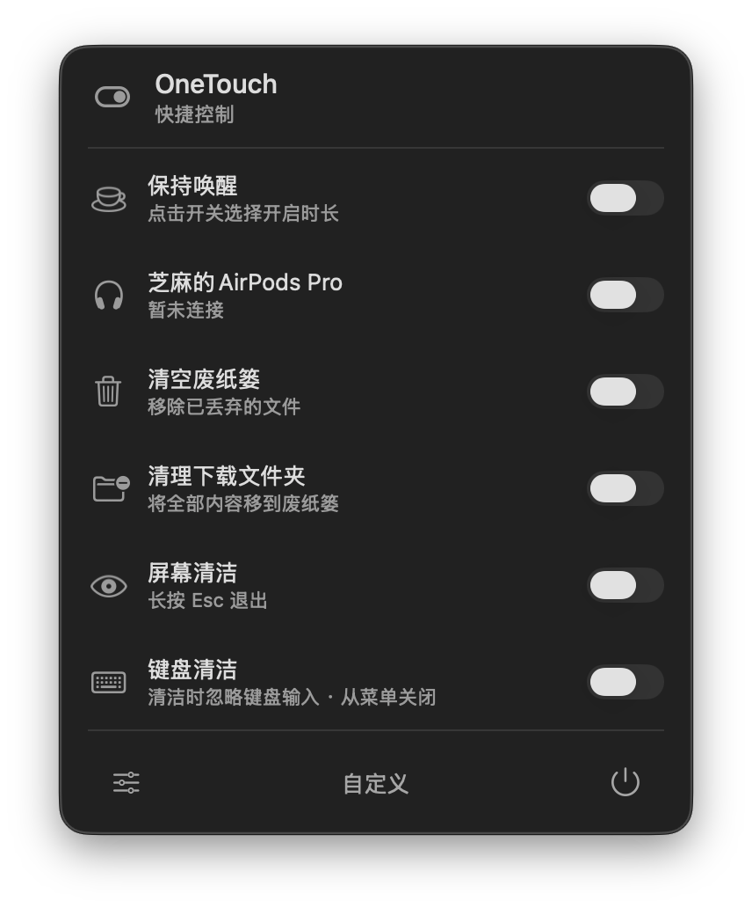
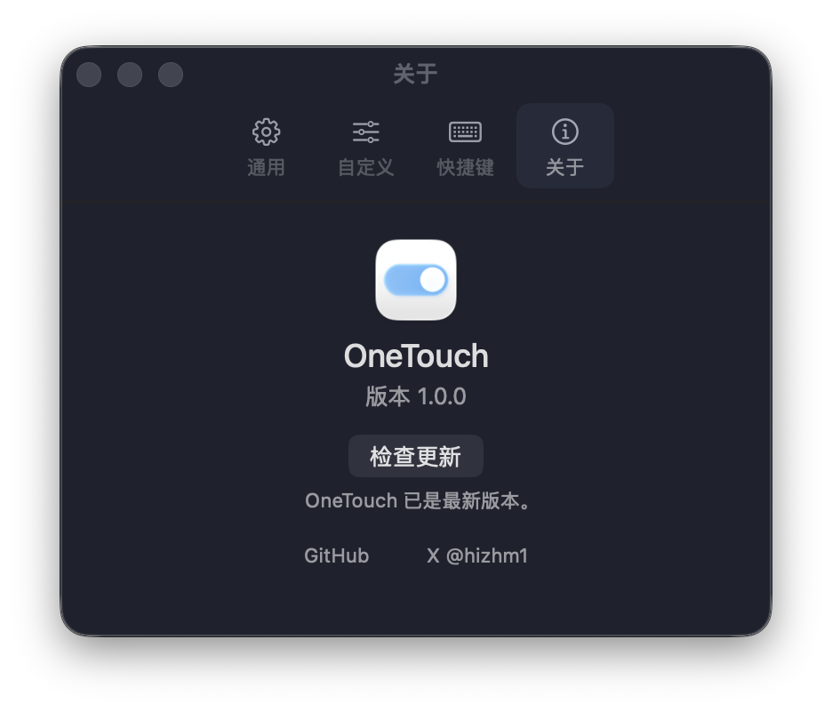

<p align="center">
  
</p>

<h1 align="center">OneTouch</h1>

<p align="center"><strong>One switch for the small Mac tasks you repeat every day.</strong></p>

<p align="center">
  <a href="README.md">简体中文</a>
  ·
  <strong>English</strong>
</p>

<p align="center">
  OneTouch is a lightweight, native macOS menu bar utility for focus, display, cleanup, device, and everyday system controls.
</p>

## Preview

<p align="center">
  
  &nbsp;&nbsp;
  
</p>

OneTouch uses native AppKit panels, controls, typography, colours, and system materials, with automatic light and dark appearance support.

<p align="center">
  <a href="https://github.com/Cherry-Yiran/OneTouch/releases/latest"><strong>Download</strong></a>
  ·
  <a href="https://github.com/Cherry-Yiran/OneTouch/releases">Release notes</a>
  ·
  <a href="https://github.com/Cherry-Yiran/OneTouch/issues">Report an issue</a>
</p>

<p align="center">
  <a href="https://github.com/Cherry-Yiran/OneTouch/releases/latest"></a>
  
  
  
</p>

## Why OneTouch

macOS settings are rarely difficult to find, but repeatedly opening Settings, switching a state, and handling permissions interrupts your work. OneTouch keeps those actions in the menu bar so one switch gets the job done.

- **One place:** frequently used controls live together in the menu bar.
- **One interaction:** both persistent settings and one-time actions use a consistent switch interaction.
- **Your order:** choose any number of controls, search them, and drag to reorder. The panel stays compact and scrolls after eight items.
- **Native macOS experience:** panels, switches, menus, preferences, and dynamic materials use AppKit.
- **Local by default:** system actions run on your Mac; OneTouch does not upload activity data.

## Features

### Focus and display

- Dark Mode, Focus, and Keep Awake with native duration choices
- Night Shift, True Tone, Low Power Mode, and High Power Mode
- Screen resolution, display sleep, screen saver, and Stage Manager

### Desktop and productivity

- Hide desktop icons, widgets, the Dock, or show hidden Finder files
- Control Music and Spotify playback
- Global shortcuts, launch at login, and lock screen
- Quit other Dock apps normally while keeping your current app, OneTouch, and Finder open

### Cleanup and devices

- Screen cleaning and keyboard cleaning
- Clear Downloads, Xcode derived data, Trash, and clipboard
- Connect Bluetooth headphones and view their battery level
- Eject external disks or mounted DMGs, with a protection list for important disks
- Mute the microphone

OneTouch currently includes **30 controls**. Hardware-dependent or unavailable controls are clearly shown as unavailable.

## Install

1. Open the [latest release](https://github.com/Cherry-Yiran/OneTouch/releases/latest) and download `OneTouch_*_aarch64.dmg`.
2. Open the DMG and drag OneTouch into Applications.
3. Follow the first-launch guide to grant Accessibility permission.
4. Click the switch icon in the menu bar.

The current release supports **Apple Silicon Macs** running **macOS 13 or later**.

Public builds use a stable OneTouch signing certificate and a separate Tauri updater signature. Because the app is not notarised through Apple Developer ID, macOS may ask you to allow the first launch in System Settings → Privacy & Security. After installation, use About → Check for Updates to install later releases.

## How controls behave

- Regular controls switch immediately.
- One-time actions stay on while running and turn off when complete.
- Keep Awake, Dark Mode, and Focus show a native duration menu when switched on.
- Keyboard Cleaning ignores regular, modifier, function, and media keys until you turn it off with the mouse.
- Clear Downloads moves every item in Downloads to the system Trash; it does not permanently delete files.
- Quit Other Apps sends the standard macOS quit request and never force-quits apps.
- Use Preferences → Customise to select and reorder controls.
- Use Preferences → Shortcuts to record optional global shortcuts.

## Privacy and permissions

OneTouch guides you through the core Accessibility permission on first launch so later controls are not interrupted. Feature-specific Automation, Bluetooth, or Focus permissions are requested only when needed.

- All system actions run locally.
- OneTouch does not upload control history or personal data.
- It does not force-quit other apps.
- Protected disks are never ejected automatically.
- Update packages are verified with a Tauri signature.

## Development

Stack: React, Vite, Tauri 2, Rust, Objective-C / AppKit, Core Graphics, and IOBluetooth.

Development requires macOS 13+, Node.js, pnpm, Rust stable, and Apple Command Line Tools.

```bash
pnpm install
pnpm native:dev
```

Run tests:

```bash
pnpm test:ui
cargo test --manifest-path src-tauri/Cargo.toml
```

Build the app:

```bash
TAURI_SIGNING_PRIVATE_KEY="$(< /path/to/onetouch.key)" \
TAURI_SIGNING_PRIVATE_KEY_PASSWORD="your-key-password" \
pnpm native:build
```

Build artifacts are written to `src-tauri/target/release/bundle/`. Pushing a `v*` tag creates a draft GitHub Release. GitHub Actions signs the app with the configured macOS certificate and signs updater artifacts with the Tauri private key before publishing them.

## Design and implementation

OneTouch uses Apple public AppKit components and semantic system parameters. It does not manually imitate macOS glass, colours, blur levels, button states, or menu behaviour.

- [Interface principles and layout constraints](docs/DESIGN_PRINCIPLES.md)
- [Apple component references](docs/APPLE_COMPONENTS.md)

## Contributing

Issues and pull requests are welcome. When reporting a problem, please include your macOS version, OneTouch version, steps to reproduce, and a screenshot when possible.
